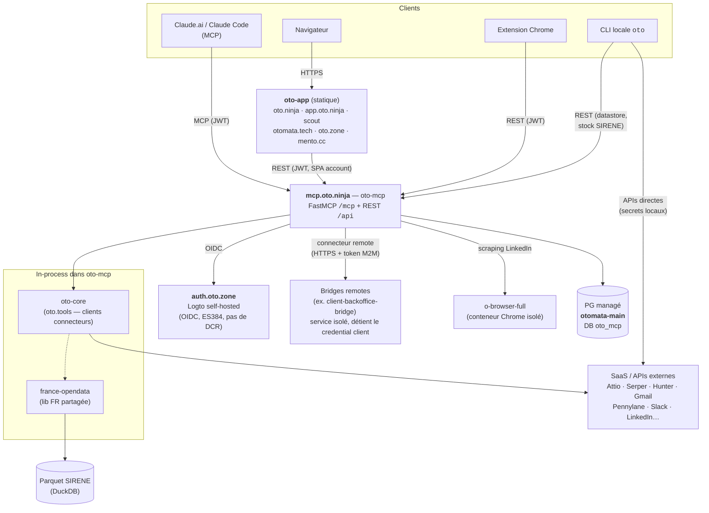

# Architecture — plateforme Oto

Vue d'ensemble cross-repo. Le détail par composant vit dans le `CLAUDE.md`/`docs/` de chaque repo (liens en fin de section). Mise à jour : 2026-06-10.

## Les composants

| Composant | Repo | Rôle |
|---|---|---|
| **oto-core** | `otomata-tech/oto-core` (public) | **Lib de clients connecteurs** (`oto.tools` + `oto.config`, namespace). Source unique, consommée in-process par oto-cli ET oto-mcp. Split d'oto-cli (otomata#13). |
| **oto-cli** | `otomata-tech/oto-cli` (public) | **Façade CLI** Typer (`oto <cmd>`) sur oto-core. Basse priorité, surtout fallback local LinkedIn browser. |
| **oto-mcp** | `otomata-tech/oto-mcp` | **Produit central déployable** (SaaS/on-premise). Serveur MCP (`mcp.oto.ninja/mcp`) + REST `/api/*`. Expose les connecteurs **oto-core** comme tools, gère users/orgs/credentials/quotas/visibilité. **Back comptes** de tout l'univers Otomata. |
| **oto-app** | `otomata-tech/oto-app` | Monorepo fronts : `web/` (oto.ninja, SSG), `account/` (SPA compte auth-gated), `scout/`, `sites/*` (otomata.tech, oto.zone, mento.cc), `extension/` (Chrome MV3), `packages/ui` (@otomata/ui vendored). |
| **plugin** | `otomata-tech/oto-plugin` (public) | Plugin Claude Code : connecteur MCP auto-configuré + 1 skill universel. Porte d'entrée onboarding tiers. |
| **client-backoffice-bridge** | `otomata-tech/client-backoffice-bridge` (privé) | Bridge a client : service distant détenant le credential the client, consommé via le connecteur remote ([ADR 0003](adr/0003-remote-connector-bridge.md)). + commandes CLI locales (`oto client`). |
| **france-opendata** | `otomata-tech/france-opendata` (PyPI public) | Clients données FR (SIRENE, INPI, BODACC, DVF, Recherche Entreprises) + `sirene_stock` (DuckDB sur parquet). Consommée par oto-core, oto-mcp, tuls, a client. |
| **o-browser** | `AlexisLaporte/o-browser` | Lib browser canonique (Patchright) + conteneur **o-browser-full** (Chrome isolé en cgroup) auquel oto-mcp délègue le scraping LinkedIn. |

## Surfaces et flux

Trois chemins d'accès aux mêmes connecteurs :

1. **MCP** (`mcp.oto.ninja/mcp`) — Claude.ai / Claude Code / plugin. Auth = bearer JWT Logto, ~175 tools, visibilité per-user (presets, masquage par défaut des namespaces sensibles).
2. **REST** (`mcp.oto.ninja/api/*`) — consommé par la SPA `account/` (gestion du compte : credentials, presets, admin), l'extension Chrome (push cookie LinkedIn, pairing WhatsApp), et la CLI pour les features serveur-side (datastore, secrets per-user `oto ninja`, stock SIRENE). Auth = JWT Logto **ou** API token long-lived `oto_…`.
3. **CLI locale** (`oto <cmd>`) — exécution directe sur la machine de l'utilisateur, secrets résolus localement (env → SOPS). Pas de serveur dans la boucle, sauf pour les commandes qui sont des clients HTTP de l'API REST (datastore, stock SIRENE — cf. ADR 0001).

**Identité** : Logto self-hosted (`auth.oto.zone`), un seul compte par utilisateur pour tout l'univers (fusion oto-app `oto-app/docs/PLAN.md`). Signature **ES384** (gotcha : default RS256 des verifiers), **pas de DCR** (tout client OAuth pré-créé via Management API). La table `oto_mcp.users` (clé = `sub` Logto) est la clé d'agrégation des comptes.

## Connecteurs — taxonomie et modèle de secrets

Le modèle complet (registre source unique, coffre, résolution, axes disponibilité/visibilité/configuration) est documenté dans **`oto-mcp/docs/connector-vault.md`** — référence à lire avant de toucher credentials/registre. Résumé :

- **Registre** (`oto_mcp/connectors.py`) = source unique dont dérivent providers, namespaces, quotas, bundle par défaut, frontend.
- **Coffre** = table unique `connector_credentials` (clés API user, secrets d'org, platform keys, sessions LinkedIn/Crunchbase, OAuth Google multi-compte). Chiffrement enveloppe AES-256-GCM **actif** (depuis 2026-06-11, sur la box dédiée — 0 plaintext, master key via Secret Manager fetchée au boot, jamais sur disque ; cible KMS-wrap, ADR 0002).
- **Résolution** (`resolve_api_key`) : credential user → credential org (si org-partageable + org active) → platform key + grant explicite + quota → erreur actionnable. **Injection, jamais d'auto-résolution serveur** : l'unit pose `OTO_CONFIG_DISABLE_SOPS=1`, tout `require_secret` côté serveur échoue fort (oto-mcp#12).

Deux mondes de secrets, étanches :

| Contexte | Résolution |
|---|---|
| CLI locale | env → SOPS (`~/.otomata/secrets/`, multi-fichiers age) → erreur |
| Serveur oto-mcp | env de process (infra bootstrap uniquement : DATABASE_URL, Logto, OAuth) + coffre DB (tout le reste) ; SOPS court-circuité |

### Core vs custom — où vit le code d'un connecteur

- **Connecteur générique** (Serper, Attio, Gmail…) → client `oto/tools/<svc>/` dans **oto-core** (public) + commande `oto/commands/<svc>.py` dans oto-cli (façade) + module tool `oto_mcp/tools/<svc>.py` dans oto-mcp. Secret dans le coffre central.
- **Connecteur custom/client-sensible** (auth reverse-engineerée, infra d'un client, endpoint confidentiel) → **jamais dans le core public, ni dans oto-mcp**. Modèle **bridge** ([ADR 0003](adr/0003-remote-connector-bridge.md)) : repo privé `<client>-<système>-bridge` = service HTTP isolé qui détient le credential et le code client ; oto-mcp le consomme via le **connecteur remote** générique (auth + entitlement + forward, token M2M dans le coffre — jamais le credential client). Côté CLI locale, le même package se branche par entry-point `oto.commands` (`oto <name>`, secrets locaux).

**Cas client (a client)** — le pilote du modèle bridge : `otomata-tech/client-backoffice-bridge` (ex-`oto-client`), namespace `client` grant-only côté plateforme, bridge hébergeable chez Otomata (pilote) puis dans l'infra a client (custody complète client). Dossier sécurité présentable : `client-backoffice-bridge/docs/securite-plateforme.md`.

## Données entreprise France (`fr_*`)

Namespace unifié `fr_` (CLI `oto fr`, tools MCP `fr_*`) sur 5 sources (Recherche Entreprises, INSEE SIRENE, INPI, BODACC, BOAMP). Toute la logique vit dans **france-opendata** (lib partagée) ; oto-cli et oto-mcp ne font que l'exposer.

Le **stock SIRENE** (parquet INSEE ~2 GB, 43M établissements) est servi par oto-mcp via DuckDB en place — décision et alternatives dans [ADR 0001](adr/0001-sirene-stock-served-via-mcp.md), amendé par [ADR 0002](adr/0002-platform-dedicated-scaleway-box.md) (découplage du parquet de la future box plateforme). La query layer est `france_opendata.sirene_stock`, consommée par oto-mcp (tools + REST) **et** in-process par les apps co-localisées (tuls).

## Browser automation

oto-mcp ne lance plus de Chrome in-process : le scraping LinkedIn est délégué au conteneur **o-browser-full** (Docker, mémoire cappée — un OOM browser ne touche pas l'API). Contraintes LinkedIn (empreinte TLS → vrai Chrome obligatoire ; isolation de session → outreach user réel = CLI locale, serveur = profils dédiés pairés) : `CLAUDE.md` racine §LinkedIn + issue oto-mcp#5.

## Harnais construits sur le substrat

oto = le **substrat** (connecteurs, coffre, identité, datastore). Les **harnais** (= un connecteur MCP avec sa doctrine en porte d'entrée + un état persistant) vivent **à part** et consomment oto par contrat — jamais en réimplémentant un connecteur ([ADR 0006](adr/0006-harnais-vs-substrat.md)) :

- **scout** — harnais prospection de l'univers oto : pipeline `candidate → lead → contact → action` + cockpit (shell white-label `otomata-tech/scout`). Pilot (pilot.example, a client) = première instance ; cible = généralisation multi-tenant.
- **a client / a client** — harnais métier indépendants (data model = un domaine : graph PV, foncier communal), consomment france-opendata / les connecteurs.

## Cible infra

L'état déployé et les pipelines sont dans [infra.md](infra.md). La cible structurante est l'**ADR 0002** : oto-mcp isolé sur une box Scaleway dédiée (conteneurisé, deploy pull-registry sans clé SSH, secrets Secret Manager + KMS, master key du coffre unwrappée au boot) — prérequis à l'activation du chiffrement du coffre et à l'ouverture multi-tenant sérieuse.

## Pointeurs

- `oto-mcp/CLAUDE.md` — backend en détail (auth, rôles, REST, visibilité, datastore, WhatsApp)
- `oto-mcp/docs/connector-vault.md` — registre + coffre + résolution (doc d'archi centrale)
- `oto-cli/docs/concepts.md` + `create-connector.md` — anatomie d'un connecteur, core vs custom
- `oto-app/CLAUDE.md` + `oto-app/docs/PLAN.md` — fronts, fusion identité/comptes/UI
- `docs/adr/` — décisions (SIRENE, box dédiée)
