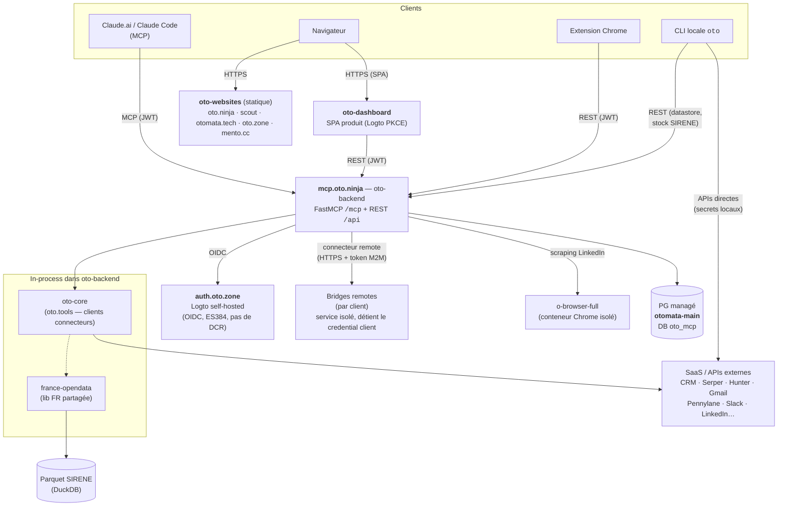

# Architecture — plateforme Oto

Vue d'ensemble cross-repo. Le détail par composant vit dans le `CLAUDE.md`/`docs/` de chaque repo (liens en fin de section).

## Les composants

| Composant | Repo | Rôle |
|---|---|---|
| **oto-core** | `otomata-tech/oto-core` (public) | **Lib de clients connecteurs** (`oto.tools` + `oto.config`, namespace). Source unique, consommée in-process par oto-cli ET oto-backend. |
| **oto-cli** | `otomata-tech/oto-cli` (public) | **Façade CLI** Typer (`oto <cmd>`) sur oto-core. Basse priorité, surtout fallback local LinkedIn browser. |
| **oto-backend** | `otomata-tech/oto-backend` (public) | **Produit central déployable** (SaaS/on-premise). Serveur MCP (`mcp.oto.ninja/mcp`) + REST `/api/*`. Expose les connecteurs **oto-core** comme tools, gère users/orgs/credentials/quotas/visibilité. **Back comptes** de tout l'univers Otomata. |
| **oto-dashboard** | `otomata-tech/oto-dashboard` (public) | **Dashboard produit** du backend (Vue 3 + shadcn-vue + Tailwind, Logto PKCE). Pas de serveur propre — le backend est oto-backend. |
| **oto-websites** | `otomata-tech/oto-websites` (privé) | Monorepo fronts : `web/` (oto.ninja, SSG), `scout/`, `sites/*` (otomata.tech, oto.zone, mento.cc), `extension/` (Chrome MV3), `packages/ui` (@otomata/ui vendored). |
| **plugin** | `otomata-tech/oto-plugin` (public) | Plugin Claude Code : connecteur MCP auto-configuré + 1 skill universel. Porte d'entrée onboarding tiers. |
| **client bridges** | privés | **Connecteurs remotes** (par client) : service distant détenant le credential client, consommé par oto-backend via le connecteur remote générique (token M2M). Le credential client ne quitte jamais le bridge. |
| **france-opendata** | `otomata-tech/france-opendata` (PyPI public) | Clients données FR (SIRENE, INPI, BODACC, DVF, Recherche Entreprises) + `sirene_stock` (DuckDB sur parquet). Consommée par oto-core, oto-backend, tuls. |
| **o-browser** | `otomata-tech/o-browser` (public) | Lib browser canonique (Patchright) + conteneur **o-browser-full** (Chrome isolé en cgroup) auquel oto-backend délègue le scraping LinkedIn. |

## Surfaces et flux

Trois chemins d'accès aux mêmes connecteurs :

1. **MCP** (`mcp.oto.ninja/mcp`) — Claude.ai / Claude Code / plugin. Auth = bearer JWT Logto, visibilité per-user (presets, masquage par défaut des namespaces sensibles).
2. **REST** (`mcp.oto.ninja/api/*`) — consommé par le dashboard (gestion du compte : credentials, presets, admin), l'extension Chrome (push cookie LinkedIn, pairing WhatsApp), et la CLI pour les features serveur-side (datastore, secrets per-user, stock SIRENE). Auth = JWT Logto **ou** API token long-lived `oto_…`.
3. **CLI locale** (`oto <cmd>`) — exécution directe sur la machine de l'utilisateur, secrets résolus localement (env → SOPS). Pas de serveur dans la boucle, sauf pour les commandes qui sont des clients HTTP de l'API REST (datastore, stock SIRENE).

**Identité** : Logto self-hosted (`auth.oto.zone`), un seul compte par utilisateur pour tout l'univers. Signature **ES384** (gotcha : default RS256 des verifiers), **pas de DCR** (tout client OAuth pré-créé via Management API). La table `oto_mcp.users` (clé = `sub` Logto) est la clé d'agrégation des comptes.

## Connecteurs — taxonomie et modèle de secrets

Le modèle complet (registre source unique, coffre, résolution, axes disponibilité/visibilité/configuration) est documenté dans **`oto-backend/docs/connector-vault.md`**. Résumé :

- **Registre** (`oto_mcp/providers.py`) = source unique dont dérivent providers, namespaces, quotas, bundle par défaut, frontend.
- **Coffre** = table unique `connector_credentials` (clés API user, secrets d'org, platform keys, sessions LinkedIn/Crunchbase, OAuth Google multi-compte). Chiffrement enveloppe AES-256-GCM **actif** (0 plaintext, master key via Secret Manager fetchée au boot, jamais sur disque).
- **Résolution** (`resolve_api_key`) : credential user → credential org (si org-partageable + org active) → platform key + grant explicite + quota → erreur actionnable. **Injection, jamais d'auto-résolution serveur** : tout `require_secret` côté serveur échoue fort.

Deux mondes de secrets, étanches :

| Contexte | Résolution |
|---|---|
| CLI locale | env → SOPS (vault perso multi-fichiers age) → erreur |
| Serveur oto-backend | env de process (infra bootstrap uniquement : DATABASE_URL, Logto, OAuth) + coffre DB (tout le reste) ; SOPS court-circuité |

### Core vs custom — où vit le code d'un connecteur

- **Connecteur générique** (Serper, Gmail, Pennylane…) → client `oto/tools/<svc>/` dans **oto-core** (public) + commande dans oto-cli (façade) + module tool dans oto-backend. Secret dans le coffre central.
- **Connecteur custom/client-sensible** (auth reverse-engineerée, infra d'un client, endpoint confidentiel) → **jamais dans le core public, ni dans oto-backend**. Modèle **bridge** : repo privé `<client>-<système>-bridge` = service HTTP isolé qui détient le credential et le code client ; oto-backend le consomme via le **connecteur remote** générique (auth + entitlement + forward, token M2M dans le coffre — jamais le credential client). Côté CLI locale, le même package se branche par entry-point `oto.commands`.

Le modèle bridge a un **pilote** en production (un back-office client, namespace grant-only, bridge hébergeable côté Otomata puis côté client pour une custody complète).

## Données entreprise France (`fr_*`)

Namespace unifié `fr_` (CLI `oto fr`, tools MCP `fr_*`) sur plusieurs sources (Recherche Entreprises, INSEE SIRENE, INPI, BODACC, BOAMP). Toute la logique vit dans **france-opendata** (lib partagée) ; oto-cli et oto-backend ne font que l'exposer.

Le **stock SIRENE** (parquet INSEE ~2 GB, 43M établissements) est servi par oto-backend via DuckDB en place. La query layer est `france_opendata.sirene_stock`, consommée par oto-backend (tools + REST) **et** in-process par les apps co-localisées.

## Browser automation

oto-backend ne lance plus de Chrome in-process : le scraping LinkedIn est délégué au conteneur **o-browser-full** (Docker, mémoire cappée — un OOM browser ne touche pas l'API). Contraintes LinkedIn (empreinte TLS → vrai Chrome obligatoire ; isolation de session → outreach user réel = CLI locale, serveur = profils dédiés pairés).

## Harnais construits sur le substrat

oto = le **substrat** (connecteurs, coffre, identité, datastore). Les **harnais** (= un connecteur MCP avec sa doctrine en porte d'entrée + un état persistant) vivent **à part** et consomment oto par contrat — jamais en réimplémentant un connecteur. Exemples : prospection (pipeline `candidate → lead → contact → action` + cockpit) ; harnais métier verticaux (data model = un domaine), qui consomment france-opendata et les connecteurs.

## Pointeurs

- `oto-backend/CLAUDE.md` — backend en détail (auth, rôles, REST, visibilité, datastore)
- `oto-backend/docs/connector-vault.md` — registre + coffre + résolution (doc d'archi centrale)
- `oto-cli/docs/` — anatomie d'un connecteur, core vs custom
